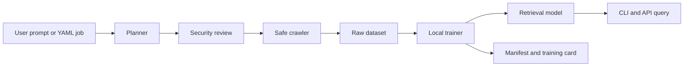

# Architecture

AutoTrain Data Forge is a local-first AI training pipeline for authorized web data collection. It turns a user request into a reviewed job, collects data from allowlisted sites, trains a local retrieval model, and produces audit artifacts that explain what was collected and how it was used.



## Components

- `schemas.py` defines the public job, review, crawl, training, and query contracts.
- `llm.py` converts natural-language requests into draft jobs using a local heuristic parser or an OpenAI-compatible chat endpoint with a user-owned API key.
- `security.py` blocks high-risk targets such as localhost, private IP ranges, unsupported schemes, disabled robots.txt, and unsafe output paths.
- `crawler.py` performs respectful crawling with domain allowlists, robots.txt checks, rate limits, text filters, URL filters, and bounded image downloads.
- `training.py` builds a local TF-IDF retrieval index from collected text and image metadata.
- `retrieval.py` queries the trained model without sending data to a remote provider.
- `api/main.py` exposes the same workflow over FastAPI.

## Data Layout

Each job writes inside its own folder under `data/jobs/<job-name>` by default.

```text
data/jobs/example/
|-- raw/
|   |-- pages.jsonl
|   |-- images.jsonl
|   `-- images/
|-- model/
|   |-- documents.json
|   |-- matrix.joblib
|   `-- vectorizer.joblib
|-- dataset_manifest.json
`-- training_card.md
```

## Training Strategy

The default trainer intentionally uses a lightweight retrieval model. That makes the first release easy to run on Linux, macOS, and Windows without GPUs. The architecture leaves room for future trainers such as sentence embeddings, LoRA fine-tuning, image captioning, and multimodal dataset exporters.

## Deployment Modes

- CLI for local workstations and one-off jobs.
- FastAPI for a local GUI or trusted internal service.
- Docker Compose for repeatable local environments.
- GitHub Actions for linting, type checking, and tests.
